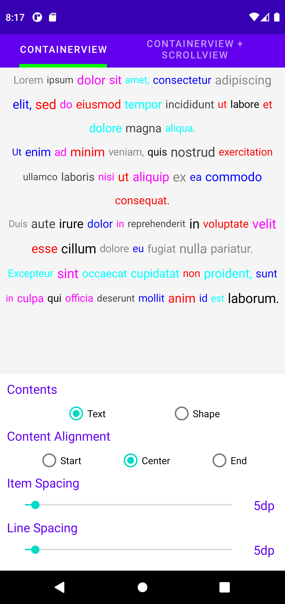
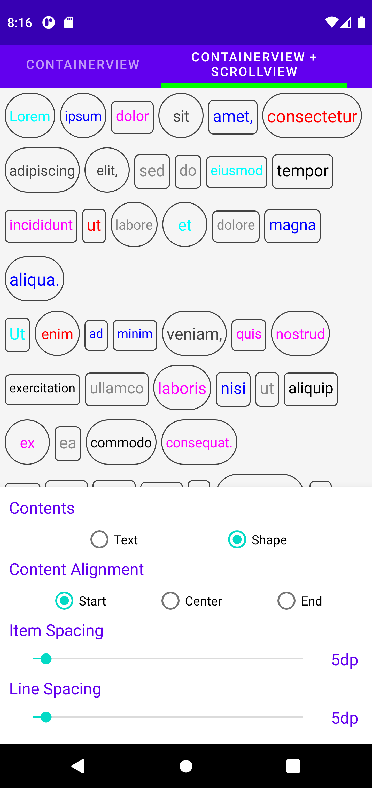

# FlexibleContainerView [](https://jitpack.io/#Lulixue/FlexibleContainerView)

A Flexible Container to auto position & measure subviews for Android. 

## Centered TextViews 
<p align="center">
    
</p>

## Auto Aligned Shapes With ScrollView 
* A more button is available. 
<p align="center">
  
</p>


## Usages
1. Add it in your root build.gradle at the end of repositories:
```Groovy
allprojects {
    repositories {
        ...
        maven { url 'https://jitpack.io' }
    }
}
```
2. Add the dependency
``` Groovy
dependencies {
    implementation 'com.github.Lulixue:FlexibleContainerView:1.0'
}
```
